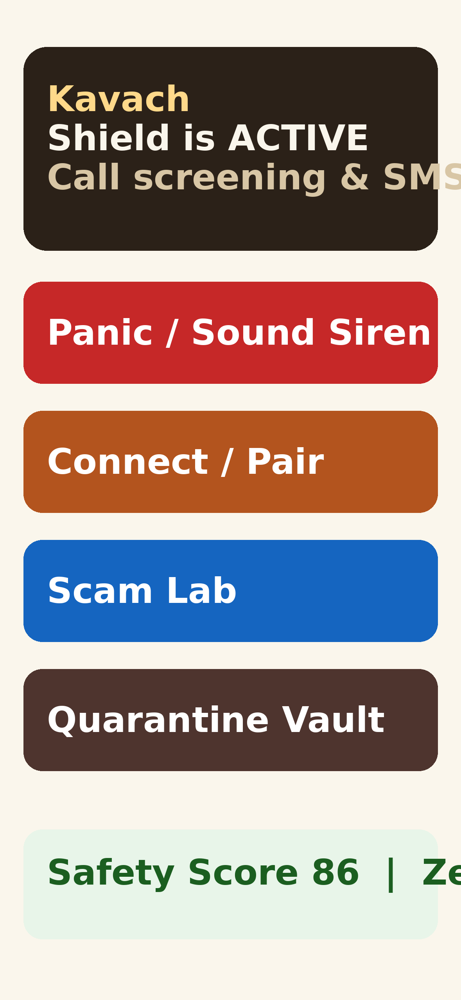

# Kavach 🛡️ (कवच — Shield)

### Pause pressure. Verify independently. Bring family. *Without uploading calls.*

[](https://revenuecat-shipaton-2026.devpost.com)
[](https://github.com/krishivjoshi219-collab/Kavach/actions)
[](https://developer.android.com)
[](https://github.com/google/tink)
[](./agent/rulepack.py)
[](./docs/SUBMISSION_NEXTGEN.md)
[](./LICENSE)

> **11:40 AM. Your mother's phone lights up.** *"Bank account FROZEN. Share the OTP now, or the police will arrest you today."*
> She panics. Her thumb hovers over the code.
> **Unless Kavach is on her phone.** The SMS never buzzes. A calm siren rises instead: *"Ruko. OTP mat do."* In 10 seconds you — at work — read the full decrypted lure, tap **Block**, and when they call back, the phone kills it **before the first ring**. Then you both see the proof: the server holds nothing but noise.
>
> Kavach doesn't *chat* about scams. **It acts on them.** And unlike static blocklists, **it learns every morning** — signed rules + community protection, without ever uploading a call.

Elder fraud is widely reported as a **$10B+/year problem in the US alone (FBI IC3 2023–2024 estimates; global losses higher but hard to measure)**. The theft hurts; the shame destroys — victims stop trusting phones, banks, even family. Kavach exists for one belief: **protection for people who cannot verify, proof for the families who can — with dignity intact, in Hindi, Hinglish, and English.**

Built by a **13-year-old student** for the **RevenueCat Shipaton 2026 — Next Gen Award**. **TEST MODE throughout: no cards, no charges** — judges unlock Pro with promo `SHIPATON-JUDGE`. Submission pack: [`docs/SUBMISSION_NEXTGEN.md`](./docs/SUBMISSION_NEXTGEN.md) · live proof: `/api/nextgen/proof`.

---

## 🎬 Watch it save Asha in 2 minutes

```text
0:00  Senior idle. Manager war-room clean. Safety Score 94.
0:15  🔴 Simulated attack: Bank-OTP SMS lands → zero buzz → siren on BOTH phones
0:40  Manager opens the full decrypted text (server sees only noise) → taps Block hash
1:00  Same number calls back → auto-reject PRE-RING, call log clean
1:15  Audit screen: relay dump = ciphertext + hashes. Kill Switch revokes everything.
1:25  📜 The shield learns: rules vN applied, signature OK — this morning's new lure, caught.
```

*Demo video (`assets/kavach-demo-2min.mp4`, <120s, 1920x1080) follows the 6-act script in [`DEMO_2MIN_WINNABLE.md`](./DEMO_2MIN_WINNABLE.md) — shot on real emulator builds of both APK flavors (Senior sanctuary + Family war-room), narrated in English with Hinglish emotional beats and full English subtitles. Voiceover generated with ElevenLabs (free tier). Prefer reading code? Start at [the 3 killer features](#-the-3-killer-features-acts-not-chats), then [the shield learns](#-the-shield-learns-signed-not-static), then [how the E2E actually works](#-true-e2e-no-theater). All brand names belong to their owners; shown only to demonstrate scam detection.*

<p align="center">
  
  &nbsp;&nbsp;&nbsp;
  
</p>

---

## 📱 Two APKs, one shield (new)

One codebase, two installable apps — so the demo never wastes a second on a role chooser:

| | 🧓 **Kavach Senior** | 🏠 **Kavach Family** |
|---|---|---|
| Package | `com.kavach.guardian.senior` | `com.kavach.guardian.manager` |
| Boots to | calm sanctuary, big type, Hindi front-and-center | dark war-room, cases + vault + Safety Score |
| Does | silent quarantine, pre-ring screen, siren, check-ins | E2E evidence, Block hash, remote siren/whisper, paywall |

Flavors in [`android/app/build.gradle.kts`](./android/app/build.gradle.kts) (`BuildConfig.APP_ROLE` auto-routes in `RoleSelectionActivity`). CI builds both: artifacts `kavach-senior-apk` + `kavach-manager-apk` on every `main` push → `adb install` (Android 10+).

---

## ⚡ The 3 killer features (acts, not chats)

### K1. 🔴 Live Attack Simulator — senior sitting, spam incoming
One tap in Scam Lab (or the web war-room) fires a Bank-OTP / Digital-Arrest / Power-APK lure through the **same production path** as a real SMS — `SmsHandler → RuleEngine → quarantine → E2E forward → dual siren`. In the real app, no fake UI. End the round by asking the same number to call: the second call dies pre-ring via the learned block hash.
*Code: [`android/.../sms/SmsHandler.kt`](./android/app/src/main/java/com/kavach/guardian/sms/SmsHandler.kt), [`android/.../ui/ScamLabActivity.kt`](./android/app/src/main/java/com/kavach/guardian/ui/ScamLabActivity.kt), `POST /api/demo/attack`.*

### K2. 📥 Quarantine Vault — the inbox scams never reach
Scam SMS are suppressed from notifications, kept in a private on-device vault with OTPs masked (`******`), E2E-forwarded to the manager **only on SCAM/SUSPICIOUS with lent `forward_sms` consent**, and one-tap Block+Report teaches the whole household — sibling devices sync the same household list, no 3-household wait. Clean messages? Untouched, unbuzzed-about, unforwarded.
*Code: [`ui/QuarantineActivity.kt`](./android/app/src/main/java/com/kavach/guardian/ui/QuarantineActivity.kt), [`data/LocalStore.kt`](./android/app/src/main/java/com/kavach/guardian/data/LocalStore.kt), `POST /api/family/block-case`, `GET /api/v1/screen/list`, web vault in [`FamilyBoard.tsx`](./simulator/web/src/components/FamilyBoard.tsx).*

### K3. 🏠 Family War-Room + Safety Score — proof, not panic
Pulsing red banner on the latest threat, evidence-chained case file (every verdict cites its red flags), SVG Safety Score that climbs with check-ins and safe weeks, quarantine mirror with masked OTPs. The manager sees **minimum necessary**: verdict + sender-hash + timestamp always, full body only on scam-like with consent.
*Code: [`simulator/web/src/components/FamilyBoard.tsx`](./simulator/web/src/components/FamilyBoard.tsx), `GET /api/family-feed`.*

### Depth behind them
* **Family Proof challenge** — verify the *enrolled device*, not the voice/number: `POST /api/family/challenge/create|respond`. Grandchild voice-clone dies here. Copy never claims `caller verified`.
* **Digital-Arrest Defuser** — offline pause cards in EN/HI/Hinglish (`GET /api/pause-card`) + curated Official Directory (`GET /api/directory/lookup`, domain + verified date, never authenticates a caller).
* **Dignity check-ins** — `I'm okay / Call me / Need help now`, server-owned state machine, gentle escalation copy. No fear-mongering, no leaderboard shame.

---

## 📜 The shield learns (signed, not static)

Static blocklists rot — scammers rotate lures weekly. Kavach learns two ways, both privacy-preserving, both auditable:

### L1. Versioned signed rule packs — today's rules, verified
The relay publishes the rule pack built from the one source of truth (`agent/redflags.py`, zero drift): `GET /api/v1/rules/pack` → `{pack, signature, public_key}`. Ed25519-signed; the app applies a pack **only if the signature verifies AND the version is newer**, else keeps baked-in/last-good rules and says so. The Audit screen shows *"Rules vN · signature OK · updated HH:MM"*.
*Code: [`agent/rulepack.py`](./agent/rulepack.py), [`net/RulePack.kt`](./android/app/src/main/java/com/kavach/guardian/net/RulePack.kt), overlay in [`screen/RuleEngine.kt`](./android/app/src/main/java/com/kavach/guardian/screen/RuleEngine.kt) (`judgeWithPack`, same thresholds, bad-pattern-safe). Tests: [`tests/test_rulepack.py`](./tests/test_rulepack.py) (parity, roundtrip, tamper/wrong-key reject). Canonical JSON verified byte-for-byte across Python ↔ Kotlin.*

### L2. Community shield — one family's block protects all families
Every household Block files an anonymized sender-**hash** report (raw numbers never exist server-side). Sibling phones in the **same household sync instantly** (`GET /api/v1/screen/list`); at **3 independent households**, the hash ships in `GET /api/v1/threat-feed` (hashes only). Phones cache it for offline pre-ring screening, entries visibly marked, manager-removable in one tap, Kill Switch wipes them. Unblock retracts your report; `silence` actions never feed the shield; your household list always wins.
*Code: [`agent/mobile.py`](./agent/mobile.py) (`threat_feed`, `list_blocklist`, `COMMUNITY_THRESHOLD`), [`net/CommunityShield.kt`](./android/app/src/main/java/com/kavach/guardian/net/CommunityShield.kt) (pure `decide()` + `syncHousehold()` + cached `screenHash()`), screening integration in [`screen/KavachScreeningService.kt`](./android/app/src/main/java/com/kavach/guardian/screen/KavachScreeningService.kt). Tests: [`tests/test_community.py`](./tests/test_community.py), `CommunityShieldTest.kt`.*

### Rules decide, LLM narrates (never the reverse)
Verdicts are deterministic rules — no API key, no network, no hallucination. The LLM only rephrases debriefs warmly, via a silent-failover chain: **Zen → Gemini → Groq → offline templates** (`agent/kavach_agent.py`, `agent/config.py`). Empty keys = templates, which carried every flood test. The Zen path is OpenAI-compatible (`OPENCODE_API_KEY` server-side only, never in the APK); free-tier Zen ids are provider-gated to OpenCode itself, so production stays keyless by design.

---

## 🔐 True E2E, no theater

```text
Senior phone                      Blind relay (FastAPI)              Manager phone
[Tink keypair, Keystore]          [hashes + noise ONLY]              [Tink keypair, Keystore]
  QR pair (code+pubHash) ────────▶ single-use code, 10-min expiry ──▶ fetch senior key
  safety numbers derived BOTH sides (SasFingerprint) — must match or abort
  scam SMS → encrypt(peer pub) ──push blob──▶ store opaque ──pull──▶ decrypt locally
  manager Block ─────────────────hash only ─▶ blocklist ──lookup──▶ pre-ring reject
  community report ──────────────hash only ─▶ 3-household gate ────▶ every phone's screen
  rule pack ─────────────────────signed JSON ▶ verify-then-apply ──▶ yesterday's rules kept offline
  Kill Switch ──revoke───────────▶ epoch+1, queued powers wiped ───▶ peer key dropped
```

* Google Tink `ECIES_P256_HKDF_HMAC_SHA256_AES128_GCM` — audited primitives, never home-rolled ([`crypto/ShieldCrypto.kt`](./android/app/src/main/java/com/kavach/guardian/crypto/ShieldCrypto.kt)).
* Server **rejects** plaintext (`otp/aadhaar/http` raw or decoded), short nonces, replayed nonces; blobs capped at 500/household with oldest-pruned; all relay mutations rate-limited (60/min, shared limiter — reads stay open for 8s command polls).
* Numbers travel as `SHA-256("kavach|household|number")` — raw numbers never leave the phone. Community feed uses a separate global salt, same guarantee.
* Kill Switch = crypto revocation: epoch bump + peer wipe + queued commands voided + community cache cleared. Future sharing stops (already-decrypted copies can't be un-read — the UI says exactly that).
* Prove it yourself: [`ui/AuditActivity.kt`](./android/app/src/main/java/com/kavach/guardian/ui/AuditActivity.kt) pulls the raw relay dump on-device — noise + leak-scanner included — plus rule-pack version/signature and a Refresh button.

---

## 💰 Business, not demo-ware ($11.99, TEST MODE)

**Free for the Senior. Paid by the Adult Child who worries.**

| | Free Shield $0 | Pro Caregiver $4.99/mo | Family Fortress $11.99/mo |
|---|---|---|---|
| On-device rules, quarantine, Scam Lab | ✅ | ✅ | ✅ |
| Self-updating rules + community shield | ✅ | ✅ | ✅ priority |
| Call screening auto-reject, remote cut, dual siren | manual | ✅ | ✅ priority |
| Cloud-brain quota | 20/mo | 200/mo | 2,000/mo |
| Seniors / caregivers | 1 / 1 | 1 / 2 | 2 parents / 6 |
| Check-in history | 7 days | 90 days | 365 days |

* 14-day Pro trial. Annual option (as shown in the demo video): **Family Guardian Annual $79.99/yr** ($6.67/mo, up to 3 parent devices). Judges: promo `SHIPATON-JUDGE` (no card, TEST MODE badge on screen).
* RevenueCat done right: offerings → `purchase(package)` → entitlement `shield_protection`/`pro_caregiver`/`family_fortress` check → server reconcile; `restorePurchases()` always; **webhook is the server authority** (`POST /api/v1/billing/webhook`, Bearer + idempotent receipts + downgrade path). Client `CustomerInfo` is UI hint only. Urgent actions, consent screens, revoke, and export are **never paywalled**. Family/annual packages resolve to `ultra`, monthly to `pro`.
* Zero-marginal-cost engine: 95% of verdicts never leave the phone — paid tiers fund inference at high contribution margins. Honest math in [`docs/REVENUECAT.md`](./docs/REVENUECAT.md).
* Acquisition: test-mode quiz funnel ([`simulator/web/public/funnel.html`](./simulator/web/public/funnel.html) → `/funnel.html`) ends at QR pairing. **No Stripe, no charges** — Funnel Vision is out of scope for Next Gen; noted as roadmap.

---

## 🧓 Senior-proof by design (and honest about limits)

* 24sp+ type, 64dp one-thumb buttons, Hindi toggle front-and-center, voice input + replay, `Ruko. Verify karo.` — not warning-wall red on launch. The Senior APK boots straight to sanctuary; no role chooser, no jargon.
* Zero-shame language everywhere: *"You did the right thing telling me."*
* What we **don't** claim: no call-audio analysis (screening sees metadata, not conversation), no guaranteed call-cut on arbitrary carriers (we ask seniors to hang up; remote cut is best-effort + siren cover), no SMS deletion without the default-SMS role — set Kavach as default SMS app before filming "never buzzes" (see `DEMO.md` step 0) — no DND bypass promises, no `caller verified` badges (caller ID spoofs). The code says what it does; the video shows it.

---

## 🧑‍⚖️ Judges: verify in 60 seconds (Next Gen — video + repo, no store needed)

```bash
git clone https://github.com/krishivjoshi219-collab/Kavach.git
cd Kavach
pip install -r mcp_server/requirements.txt
uvicorn app:app --port 7860
bash scripts/warm.sh http://localhost:7860        # healthz → readyz → SCAM proof
bash scripts/nextgen_verify.sh http://localhost:7860  # proof + block-case + assets
curl http://localhost:7860/api/nextgen/proof      # RevenueCap proof in one JSON
```

* Full pack: [`docs/SUBMISSION_NEXTGEN.md`](./docs/SUBMISSION_NEXTGEN.md) (runbook, RevenueCat story, repo map, disqualifier checklist).
* Student/academic Devpost email + parental consent form (minor entrants) still required — see the pack.

---

## 🚀 Quickstart (local, 60 seconds, $0)

```bash
git clone https://github.com/krishivjoshi219-collab/Kavach.git
cd Kavach
pip install -r mcp_server/requirements.txt
uvicorn app:app --port 7860
# or: docker compose up --build   (1-click parity, no .env needed)
bash scripts/warm.sh http://localhost:7860   # healthz → readyz → SCAM proof
```

* Senior console: `simulator/web` → `npm install && npm run build` (or `npm run dev` → `http://localhost:5173`).
* API docs: `http://localhost:7860/docs` · MCP `/mcp` (spec 2025-11-25) · board `/apps/family-board.html` · funnel `/funnel.html` · rules `/api/v1/rules/pack` · feed `/api/v1/threat-feed` · Next Gen proof `/api/nextgen/proof`.
* Android: CI artifacts `kavach-senior-apk` + `kavach-manager-apk` on every `main` push → `adb install` (Android 10+). RevenueCat/OneSignal/LLM keys empty = full TEST MODE. Local: `gradle assembleSeniorDebug assembleManagerDebug`.
* Deploy relay free (no card): Render Free via Dockerfile (`$PORT`-aware) — runbook in [`docs/DEPLOY.md`](./docs/DEPLOY.md). Set `ALLOWED_ORIGINS=*`, point `BuildConfig.KAVACH_API` at the URL. HF Docker now needs PRO — skipped deliberately.

---

## 🧪 Battle-tested, not just unit-tested (judges: run this)

```bash
ruff check app.py mobile_api.py agent mcp_server tests
pytest -q
# 61 passed: debrief walks, 10-scam/5-legit eval, pairing+expiry (+atomic
# single-winner seal race), blind-relay, quota-burst cap race,
# plaintext/nonce/size rejects, consent kill-switch + epoch, quota tiers,
# pause/directory/challenge/webhook (+stored-tier replays, empty-entitlement
# reject), block-case + household list, Next Gen proof, error status codes,
# corrupt-row degradation, relay stats + 500-cap prune, MCP handshake,
# rule-pack parity/sign/tamper, community threshold/retract/hashes-only
# (+allow-retract vote, challenge single-decision race), Zen fallback
```

Android `RuleEngineTest` (OTP-threat SCAM, power-APK SCAM, UPI-txn spared, shopping-vs-pin, bijli/paise, cbi/fir/dob parity, pack overlay, hash determinism) + `CommunityShieldTest` (threshold, override, household-wins) run in CI alongside `assembleSeniorDebug assembleManagerDebug`.

Beyond unit tests — worst-case proof, all on the real app in a sandbox emulator:
* **60-SMS flood + call bursts:** 0 crashes/ANRs in Kavach (the flood ANR'd the *system* Messages app twice — Kavach outlived it), 50MB PSS, vault persisted across force-stop.
* **Chaos round:** clumsy taps, permission revoked mid-run, airplane + dead relay, rotation, Hindi/Hinglish mixed lures — found and fixed a real P0 (`SmsReceiver` ANR → `goAsync` worker + multipart concat), siren stacking (→ `singleTask`), UPI/`shopping` false positives (→ word-boundary + directional guards).
* **Robo (Muse Spark via Zen, 120 steps):** smuggle/replay/oversize/webhook-dup/tier-flip chaos vs the relay — 0 errors, all rejects held, rate limiter behaved.
* Harness: [`scripts/robo/spark_robo.py`](./scripts/robo/spark_robo.py) (FREE model locked, env key only, kill switch).

---

## 📁 Repository map

```text
Kavach/
├── app.py                    # FastAPI: chat, feed, demo-attack, block-case, pause,
│                             #   directory, challenges, nextgen/proof,
│                             #   MCP at /mcp + /mcp/, metrics, funnel
├── mobile_api.py             # /api/v1/* blind relay: pair, blobs, blocklist + list,
│                             #   consent, commands, tier, webhook, checkin, radar,
│                             #   rules/pack, threat-feed (reads open, mutations limited)
├── agent/                    # ratelimit (shared) · mobile (relay+E2E gate+quotas+feed)
│                             #   models (seniors, cases, alerts, challenges) · redflags
│                             #   (EN+HI, 8 weighted rules — pack source of truth)
│                             #   rulepack (Ed25519 sign/verify, TEST MODE aware)
│                             #   protocols (governed debrief)
│                             #   kavach_agent (LLM narrates: Zen→Gemini→Groq→templates)
│                             #   notifications (OneSignal journeys)
├── android/                  # Two native APKs from one codebase (Kotlin, SDK 34,
│   │                         #   flavors: senior .senior / manager .manager)
│   └── app/src/main/java/com/kavach/guardian/
│       ├── crypto/ShieldCrypto.kt + SasFingerprint.kt   # Tink ECIES + safety numbers
│       ├── screen/RuleEngine.kt (+judgeWithPack) + KavachScreeningService.kt
│       │                                                 # (household→community→allow)
│       ├── sms/SmsReceiver.kt (goAsync+concat) + SmsHandler.kt  # one path: real+demo,
│       │                         # consent-gated forward, hash-tagged incident log
│       ├── net/RelayClient.kt + RulePack.kt + CommunityShield.kt
│       │                             # fetch, Tink-verify, cache, household sync
│       ├── siren/SirenActivity.kt (singleTask)          # Hinglish lockscreen siren
│       └── ui/ Senior (learns badge), Family war-room (real hash block),
│           Pairing (QR+SAS), Paywall (real purchase/restore/promo),
│           ScamLab (+live attack), Quarantine (real hash block),
│           Audit (noise proof + rules version/sig + refresh),
│           Onboarding, KavachTheme
├── simulator/web/            # Senior shield + Family war-room + vault + score ring
├── data/official_directory.json  # curated verify-independently directory
├── scripts/warm.sh + nextgen_verify.sh  # warm + proof chain, Next Gen gate
├── scripts/robo/             # Spark Robo harness (sandbox chaos, FREE model)
├── docs/                     # SUBMISSION_NEXTGEN · REVENUECAT · MOBILE_CONTRACT
│                             #   ARCHITECTURE · DEPLOY · API
├── assets/                   # icon-1024.png · screenshot-1179x2556.png (Devpost-ready)
├── .github/workflows/ci.yml  # backend + frontend + senior/manager APKs + docker
└── LICENSE                   # MIT — visible in About
```

---

## 🔒 Safety, dignity & ethics

* Seniors are protectors' partners, not surveillance subjects — every manager power is **lent**, revocable in one tap, epoch-rotated. Community entries are marked, removable, Kill-Switch-wiped.
* No medical, legal, or investment advice. Pause cards are general safety information with disclaimers, reviewed offline packs.
* Fictional demo household (`Asha`, redacted `+91-98XXX` numbers). Per-senior IDs isolate families. No address-book scraping, no invite spam. Threat feeds carry hashes, never numbers. *All brand names belong to their owners; shown only to demonstrate scam detection.*

---

## 👥 Built by

**Krishiv Joshi** ([@krishivjoshi219-collab](https://github.com/krishivjoshi219-collab)) — 13-year-old student. Full-stack architecture, cryptography, native Android, backend, and business design — for the **RevenueCat Shipaton 2026 · Next Gen Award**.

*Powered by [RevenueCat](https://www.revenuecat.com) (sandbox/test mode) · [Google Tink](https://github.com/google/tink) · [Android Telecom](https://developer.android.com/reference/android/telecom/CallScreeningService) · [OneSignal](https://onesignal.com) (journeys) · FastAPI · Vite.*

*Kavach is a family escalation aid and fraud companion — not professional, legal, medical, or emergency advice. In danger, contact local emergency services.*
