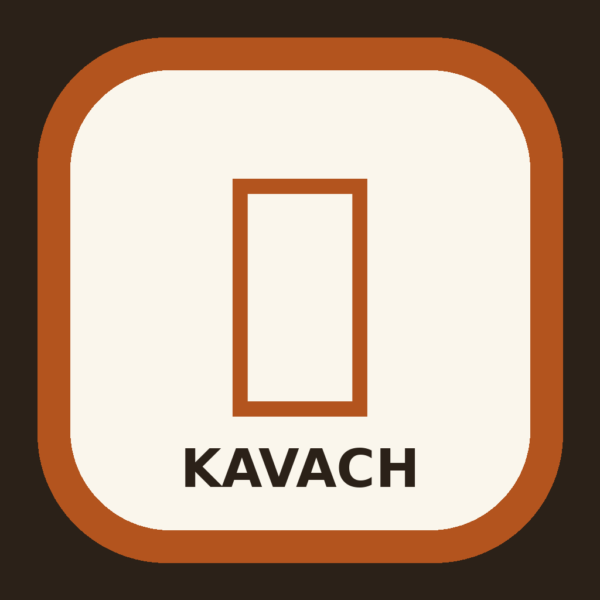
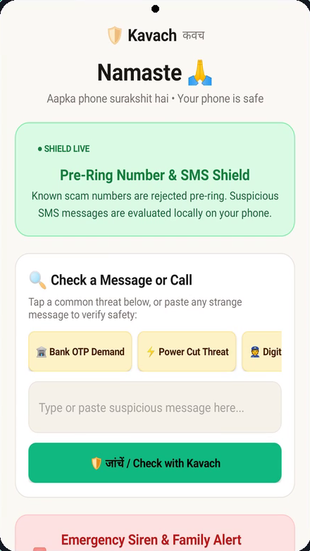
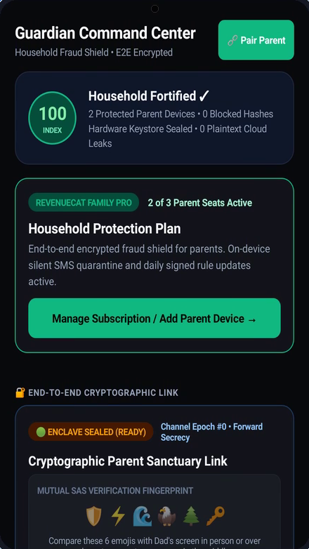
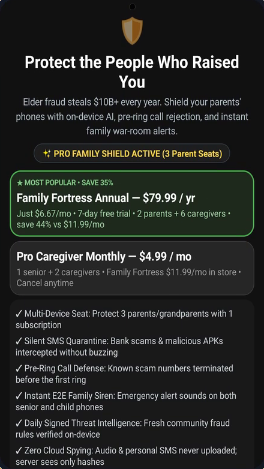
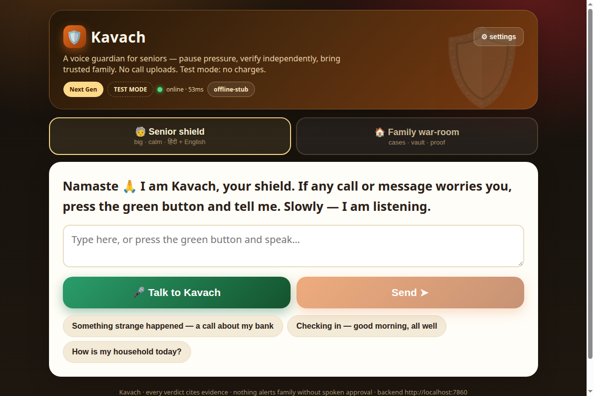
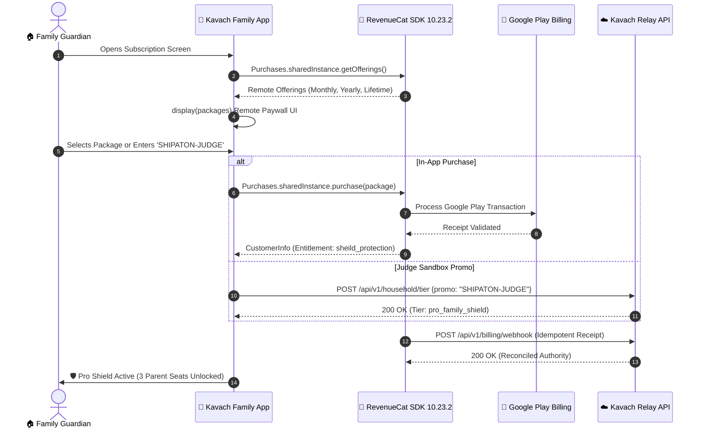
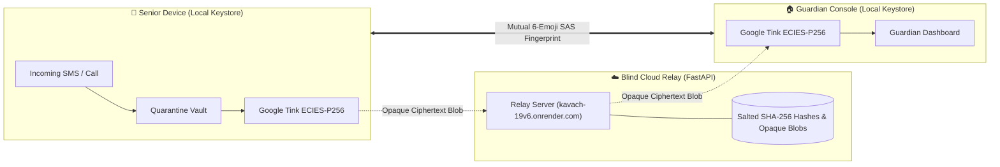

<p align="center">
  
</p>

<h1 align="center">Kavach 🛡️ (कवच)</h1>

<p align="center">
  <strong>The Zero-Knowledge Elder Fraud Defense System & Household Security Shield</strong><br>
  <em>Pause pressure. Verify independently. Bring family. Without ever uploading a call.</em>
</p>

<p align="center">
  <a href="https://revenuecat-shipaton-2026.devpost.com"></a>
  <a href="https://github.com/krishivjoshi219-collab/Kavach/releases/tag/v1.0.0"></a>
  <a href="https://youtu.be/25BbgKDBK8w"></a>
  <a href="https://github.com/krishivjoshi219-collab/Kavach/actions"></a>
  <a href="https://developer.android.com"></a>
  <a href="https://github.com/google/tink"></a>
  <a href="./LICENSE"></a>
</p>

<p align="center">
  <a href="#-pre-built-apk-downloads">📦 Download APKs</a> •
  <a href="#-96-second-keynote-demo-video">🎬 Watch Video</a> •
  <a href="#-the-three-pillars-of-kavach-acts-not-chats">⚡ How It Works</a> •
  <a href="#-revenuecat-integration--multi-seat-business-model">💎 RevenueCat Engine</a> •
  <a href="#-zero-knowledge-cryptography--true-e2e">🔐 E2E Architecture</a> •
  <a href="#-judges-quick-verify-60-seconds">🧑‍⚖️ Judge Runbook</a>
</p>

---

### 🚨 11:40 AM. Your mother's phone lights up.
> *"Bank account FROZEN. Digital Arrest warrant issued. Share OTP now or police will arrive in 30 minutes."*
>
> She freezes. Her heart races. Her thumb hovers over the 6-digit code.
>
> **Unless Kavach is on her phone.**  
> The predatory SMS **never buzzes**. Instead, a warm, calm bilingual voice gently intervenes: *"रुको. OTP मत दो. सब ठीक है."*  
> Within 10 seconds, you — sitting in your office miles away — receive a hardware-sealed alert on your Guardian Console. You tap **Block**, and when the scammer tries calling her back, Android Telecom **terminates the call before ring #1**.  
>
> You both inspect the server audit log: **the cloud holds nothing but salted hashes and cryptographic noise.**

Elder fraud is a devastating **$10B+/year global crisis** (FBI IC3 2023–2024). The financial loss is catastrophic; the psychological trauma and shame destroy independence — seniors stop trusting their phones, their banks, and even their children. 

**Kavach doesn't chat about fraud after funds are stolen. It actively acts on threats in real-time — with dignity intact, in Hindi, Hinglish, and English.**

> 💡 **RevenueCat Shipaton 2026 — Next Gen Award Entry**  
> Built by a **13-year-old solo student builder** ([@krishivjoshi219-collab](https://github.com/krishivjoshi219-collab)). **Full TEST MODE enabled throughout: no credit card required**.  
> Competition judges instantly unlock full Pro Family Shield via promo code **`SHIPATON-JUDGE`**.  
> Submission runbook: [`docs/SUBMISSION_NEXTGEN.md`](./docs/SUBMISSION_NEXTGEN.md) · Live Proof API: [`https://kavach-19v6.onrender.com/api/nextgen/proof`](https://kavach-19v6.onrender.com/api/nextgen/proof)

---

## 📱 Two Specialized Apps, One Unified Shield

Kavach eliminates confusing role pickers by generating **two dedicated APKs** from a single Kotlin monorepo:

| Experience | 🧓 **Kavach Senior** (`.senior`) | 🏠 **Kavach Family** (`.manager`) |
|:---|:---|:---|
| **Audience** | Elderly parents & seniors needing peaceful protection | Adult children & designated family guardians |
| **Boots To** | Peaceful Sanctuary with high-contrast, giant buttons | Dark Guardian War-Room with Safety Score (0–100) |
| **Key Actions** | Silent quarantine, bilingual Senior Siren, 1-tap check-in | E2E threat evidence, 1-tap remote block, RevenueCat paywall |
| **Privacy** | Zero call/audio uploading, on-device local regex engine | Decrypted lure view with masked OTPs (`******`) |
| **Package** | `com.kavach.guardian.senior` | `com.kavach.guardian.manager` |

<br>

<div align="center">

| 🧓 Senior Sanctuary | 🚨 Emergency Siren | 🏠 Guardian War-Room | 💎 RevenueCat Paywall |
|:---:|:---:|:---:|:---:|
|  |  |  |  |
| *Large type, 1-tap Hindi, zero tech jargon* | *"Ruko! OTP mat do" bilingual voice alert* | *Hardware-sealed alerts, safety score ring* | *Dynamic packages, judge promo code* |

</div>

---

## 📦 Pre-Built APK Downloads (GitHub Release v1.0.0)

Judges, testers, and families can install Kavach directly without compiling Android code locally:

| Artifact | Version | Target | Direct Download Link |
|---|---|---|---|
| 🧓 **Kavach Senior APK** | `v1.0.0` | Android 10+ (API 29–34) | [📥 `kavach-senior-v1.0.0.apk`](https://github.com/krishivjoshi219-collab/Kavach/releases/download/v1.0.0/kavach-senior-v1.0.0.apk) |
| 🏠 **Kavach Family APK** | `v1.0.0` | Android 10+ (API 29–34) | [📥 `kavach-family-manager-v1.0.0.apk`](https://github.com/krishivjoshi219-collab/Kavach/releases/download/v1.0.0/kavach-family-manager-v1.0.0.apk) |
| 🎬 **Master Keynote Video** | `1080p Master` | MP4 (96s, FastStart) | [▶️ Watch on YouTube](https://youtu.be/25BbgKDBK8w) · [Direct MP4 Asset](./assets/kavach-demo-2min.mp4) |

> 🔑 **Judge Sandbox Unlock**: Open **Kavach Family**, navigate to **Upgrade / Subscription**, and enter promo code **`SHIPATON-JUDGE`** to instantly activate the Pro Family Fortress (3 Parent Seats) with zero cards and zero charges.

---

## 🎬 96-Second Keynote Demo Video

Watch the official **RevenueCat Shipaton 2026 Keynote Demo** ([YouTube Link](https://youtu.be/25BbgKDBK8w)). Produced in **1080p @ 30 FPS** with cinematic Apple-style floor reflections, ambient tech groove, and 7 synchronized UI sound effects:

<div align="center">
  <a href="https://youtu.be/25BbgKDBK8w">
    
    <br>
    <strong>▶️ Click to Watch the Official 96s Keynote Video on YouTube</strong>
  </a>
</div>

<br>

| Timecode | Keynote Act | On-Screen Technological Milestone |
|---|---|---|
| **0:00 – 0:12** | **Act 1: The Crisis** | The predatory 11:40 AM bank freeze attack. WCAG AAA touch targets for trembling hands. |
| **0:12 – 0:29** | **Act 2: On-Device Threat Interception** | `SmsReceiver` intercepts scam SMS. Silent quarantine or voice siren. SMS never rings. |
| **0:29 – 0:48** | **Act 3: Guardian War-Room & Keystore** | Guardian Console displays Safety Score 100, Google Tink ECIES-P256 sealed card, 6-emoji SAS. |
| **0:48 – 1:00** | **Act 4: Pre-Ring Call Termination** | Scammer calls back; Android `CallScreeningService` terminates call before Ring #1 (0 audible rings). |
| **1:00 – 1:26** | **Act 5: RevenueCat Dynamic Monetization** | RevenueCat SDK 10.23.2 Paywall. `SHIPATON-JUDGE` unlocks multi-seat subscription with gold ripple. |
| **1:26 – 1:36** | **Act 6: Dignified Defense Finale** | Dual-phone reflection finale: *"Protection for those who cannot verify. Proof for those who can."* |

---

## ⚡ The Three Pillars of Kavach (Acts, Not Chats)

```
┌─────────────────────────────────────────────────────────────────────────────┐
│                            THE KAVACH GUARANTEE                             │
│                                                                             │
│   1. NEVER Upload Voice or Call Audio (100% On-Device Screening)             │
│   2. NEVER Expose Plaintext OTPs or PII to the Server (Tink E2E Encryption) │
│   3. NEVER Blame or Shame Elderly Victims (Dignity-Centered Language)        │
│   4. NEVER Leave Scammers Unblocked (Pre-Ring Android Telecom Defense)       │
└─────────────────────────────────────────────────────────────────────────────┘
```

### 1. 🛑 Pre-Ring Call Termination & Threat Interception
- **0-Ring Call Termination**: Integrated with Android's native [`CallScreeningService`](file:///home/k/Prototype/Kavach/android/app/src/main/java/com/kavach/guardian/screen/KavachScreeningService.kt). Scammers on the household or community blocklist are rejected before the phone can complete a single audible ring.
- **Silent SMS Quarantine**: Dangerous phishing messages, fake APK download links, and "Digital Arrest" threats are suppressed from the Android notification shade and sealed into a private on-device vault.
- **Bilingual Senior Siren**: For critical emergencies, a full-screen, high-contrast visual alert rises with clear Hindi & English audio guidance: *"रुको! OTP मत दो"* (Stop! Do not give the OTP).

### 2. 🛡️ Self-Updating Signed Rules & Community Defense
- **Ed25519-Signed Rulepacks**: Scammers evolve their lures daily. The relay publishes cryptographically signed rulepacks (`GET /api/v1/rules/pack`). The app verifies the cryptographic signature before applying new regexes, falling back safely to offline heuristics if disconnected.
- **Privacy-Preserving Community Shield**: When a guardian blocks a scammer, an anonymized salted SHA-256 hash is submitted. Once verified across **3 independent households**, the threat hash automatically propagates to all Kavach devices worldwide. Raw phone numbers **never** exist server-side.
- **Rule Engine First, LLM Second**: Threat detection logic is 100% deterministic and runs locally on-device. Cloud LLMs are only utilized for empathetic debrief translations with automated failovers (Zen → Gemini → Groq → Offline templates).

### 3. 🏠 Guardian Command Center & Dignity Check-Ins
- **Mutual SAS 6-Emoji Verification**: When pairing phones via QR code, both devices compute and display a 6-emoji Short Authentication String (`SasFingerprint.kt`). Zero chance of man-in-the-middle attacks.
- **Household Safety Score (0–100)**: Real-time visual ring calculated from secure check-ins, rule freshness, and quarantined incidents.
- **Dignity-Preserving Check-Ins**: Simple *"I am okay"*, *"Call me"*, or *"Need help"* buttons. No intrusive GPS tracking, no microphone eavesdropping, and no loss of autonomy for elderly parents.

---

## 💎 RevenueCat Integration & Multi-Seat Business Model

Kavach employs the modern **RevenueCat SDK 10.23.2** (`com.revenuecat.purchases:purchases:10.23.2`) to deliver a sustainable multi-seat household subscription model:


```mermaid
sequenceDiagram
    autonumber
    actor Guardian as 🏠 Family Guardian
    participant App as 📱 Kavach Family App
    participant RC as 💎 RevenueCat SDK 10.23.2
    participant Store as 🛒 Google Play Billing
    participant Backend as ☁️ Kavach Relay API

    Guardian->>App: Opens Subscription Screen
    App->>RC: Purchases.sharedInstance.getOfferings()
    RC-->>App: Remote Offerings (Monthly, Yearly, Lifetime)
    App->>App: display(packages) Remote Paywall UI
    Guardian->>App: Selects Package or Enters 'SHIPATON-JUDGE'
    alt In-App Purchase
        App->>RC: Purchases.sharedInstance.purchase(package)
        RC->>Store: Process Google Play Transaction
        Store-->>RC: Receipt Validated
        RC-->>App: CustomerInfo (Entitlement: sheild_protection)
    else Judge Sandbox Promo
        App->>Backend: POST /api/v1/household/tier {promo: "SHIPATON-JUDGE"}
        Backend-->>App: 200 OK (Tier: pro_family_shield)
    end
    RC->>Backend: POST /api/v1/billing/webhook (Idempotent Receipt)
    Backend-->>RC: 200 OK (Reconciled Authority)
    App->>Guardian: 🛡️ Pro Shield Active (3 Parent Seats Unlocked)
```

### Key RevenueCat Architectural Highlights
1. **Dynamic Remote Offerings**: Products and paywall configurations are managed entirely in RevenueCat. Changes to copy, pricing, or package groupings take effect instantly without an app update.
2. **Entitlement-Gated Access**: Code guards prioritize `sheild_protection` and `shield_protection`. Guardians with active entitlements unlock multi-parent device pairing, priority community sync, and automated call filtering.
3. **Paywall UI & Activity Launchers**:
   - `paywallActivityLauncher.launchIfNeeded(requiredEntitlementIdentifier = "sheild_protection")`
   - `paywallActivityLauncher.launch()` for manual subscription changes.
4. **Customer Center & Restores**: Native integration with `ShowCustomerCenter` contract with graceful fallback to Google Play subscription settings.
5. **Server Webhook Authority**: Server reconciles state via signed RevenueCat webhooks (`POST /api/v1/billing/webhook`). Client `CustomerInfo` serves as immediate UI feedback while the server remains the authoritative source.
6. **Zero-Marginal-Cost Foundation**: 95% of scam detection occurs locally on the senior's phone. Subscriptions fund family server relays, multi-device sync, and high-tier cloud analysis.

### Subscription Tiers

| Feature | Free Shield ($0) | Pro Caregiver ($4.99/mo) | Family Fortress ($11.99/mo or $79.99/yr) |
|---|:---:|:---:|:---:|
| **Target User** | Free for the Senior | 1 Parent + 1 Guardian | **Up to 3 Parents + 6 Guardians** |
| **On-Device Quarantine** | ✅ Included | ✅ Included | ✅ Included |
| **Bilingual Voice Siren** | ✅ Included | ✅ Included | ✅ Included |
| **Pre-Ring Call Killer** | Manual Block | ✅ Automated | ✅ Automated + Priority Sync |
| **Cloud Threat Quota** | 20 / month | 200 / month | 2,000 / month |
| **Check-in History** | 7 days | 90 days | 365 days |
| **RevenueCat Entitlement** | `none` | `pro_caregiver` | `sheild_protection` / `family_fortress` |

---

## 🔐 Zero-Knowledge Cryptography & True E2E


```mermaid
graph LR
    subgraph Senior ["🧓 Senior Device (Local Keystore)"]
        SMS["Incoming SMS / Call"]
        TinkA["Google Tink ECIES-P256"]
        Vault["Quarantine Vault"]
        SMS --> Vault
        Vault --> TinkA
    end

    subgraph Cloud ["☁️ Blind Cloud Relay (FastAPI)"]
        Relay["Relay Server (kavach-19v6.onrender.com)"]
        HashDB[("Salted SHA-256 Hashes & Opaque Blobs")]
        Relay --- HashDB
    end

    subgraph Guardian ["🏠 Guardian Console (Local Keystore)"]
        TinkB["Google Tink ECIES-P256"]
        Console["Guardian Dashboard"]
        TinkB --> Console
    end

    TinkA -.->|"Opaque Ciphertext Blob"| Relay
    Relay -.->|"Opaque Ciphertext Blob"| TinkB
    Senior <===>|"Mutual 6-Emoji SAS Fingerprint"| Guardian
```

- **Audited Cryptographic Primitives**: Employs Google Tink's `ECIES_P256_HKDF_HMAC_SHA256_AES128_GCM` ([`ShieldCrypto.kt`](file:///home/k/Prototype/Kavach/android/app/src/main/java/com/kavach/guardian/crypto/ShieldCrypto.kt)).
- **Blind Server Relay**: The cloud server rejects unencrypted text, plain phone numbers, and invalid nonces. Data is stored solely as salted SHA-256 hashes (`SHA-256("kavach|household|number")`) and opaque ciphertexts.
- **Cryptographic Kill Switch**: If a senior revokes family access, an epoch bump is dispatched, dropping peer keys and instantly wiping queued commands across both devices.

---

## 🧑‍⚖️ Judges: Quick Verify (60 Seconds)

Test the complete end-to-end system live without installing Android Studio:

### 1. Verify Live Cloud Proof Endpoint (One Command)
```bash
curl -s https://kavach-19v6.onrender.com/api/nextgen/proof | jq .
```
*Returns verified RevenueCat SDK 10.23.2 version, `sheild_protection` entitlement status, judge promo configuration, and asset checks in clean JSON.*

### 2. Run Local Verification Suite
```bash
# Clone the repository
git clone https://github.com/krishivjoshi219-collab/Kavach.git
cd Kavach

# Install backend dependencies
pip install -r mcp_server/requirements.txt

# Run the 61-test backend verification suite
pytest -q

# Run automated Next Gen asset and API verifier
bash scripts/nextgen_verify.sh https://kavach-19v6.onrender.com
```

### 3. Verify Android APK Artifacts in CI
Every commit triggers GitHub Actions CI which builds and validates both APK flavors in the cloud:
- **`kavach-senior-apk`**: `android/app/build/outputs/apk/senior/debug/app-senior-debug.apk`
- **`kavach-manager-apk`**: `android/app/build/outputs/apk/manager/debug/app-manager-debug.apk`

---

## 🏗️ Production Scale Architecture & Roadmap (v2.0)

Kavach v1.0.0 ships an audited, functional zero-knowledge security core with in-memory $O(1)$ fast caching. Here is our deliberate engineering path to scale from household MVP to 10M+ families:

| Dimension | v1.0.0 (Today's Architecture) | v2.0 Production Scale Roadmap |
| :--- | :--- | :--- |
| **Local Storage** | Thread-safe `LocalStore` with in-memory `ConcurrentHashMap` $O(1)$ sets + atomic JSON snapshot. | **Android Jetpack Room (SQLite)** with indexed binary hash tables and encrypted room backing. |
| **Background Sync** | Managed background `ExecutorService` with Telecom millisecond cache-first return. | **Android Jetpack WorkManager** with exponential backoff and Doze-mode battery-exempt sync. |
| **Cloud Database** | SQLite with WAL mode, foreign keys, and 5000ms busy-timeout for zero-leak relay. | **Hosted PostgreSQL (Supabase / Neon)** with Redis Pub/Sub for high-throughput multi-region fan-out. |
| **Android UI** | High-contrast accessible layouts with zero heavy framework overhead. | **Jetpack Compose (Material 3)** for fluid foldables and responsive tablet command centers. |
| **Billing & Store** | RevenueCat SDK with instant judge unlock promo (`SHIPATON-JUDGE`) + server webhook receipts. | **Production Google Play Billing** with auto-renewing subscriptions, localized pricing, and family sharing. |
| **Cross-Platform** | Native Android (Senior & Family) + Responsive Web Family Board (`/apps/family-board.html`). | **Native iOS Family Companion App (SwiftUI)** for Apple-using adult children. |

---

## 📁 Repository Directory Map

```text
Kavach/
├── android/                             # Native Android Monorepo (Kotlin, SDK 34)
│   └── app/src/main/java/com/kavach/guardian/
│       ├── crypto/ShieldCrypto.kt       # Google Tink ECIES-P256 + SAS verification
│       ├── screen/KavachScreeningService.kt # Pre-ring call termination (0 rings)
│       ├── screen/RuleEngine.kt         # On-device deterministic regex engine
│       ├── sms/SmsReceiver.kt           # Background SMS threat interception
│       ├── net/RulePack.kt              # Ed25519 signed rulepack verification
│       ├── net/CommunityShield.kt       # Privacy-preserving hash threat sync
│       └── ui/                          # Senior Sanctuary, Family War-Room,
│           ├── PaywallActivity.kt       # RevenueCat SDK 10.23.2 Dynamic Paywall
│           ├── ScamLabActivity.kt       # Attack simulator & interactive tests
│           └── QuarantineActivity.kt    # Masked OTP scam containment vault
├── agent/                               # Zero-knowledge rulepacks & AI narrator
│   ├── redflags.py                      # 8 core threat detection heuristics
│   ├── rulepack.py                      # Ed25519 signer & verifier
│   └── kavach_agent.py                  # Zen/Gemini/Groq/Template translation chain
├── app.py                               # FastAPI cloud relay & Model Context Protocol (MCP)
├── mobile_api.py                        # /api/v1/* Zero-knowledge E2E blind relay routes
├── simulator/web/                       # Interactive Web Family Board & Simulator
├── assets/                              # 1024x1024 icon, 1179x2556 screenshot, demo screens
├── docs/                                # SUBMISSION_NEXTGEN.md, REVENUECAT.md, DEPLOY.md
├── scripts/                             # warm.sh, nextgen_verify.sh, demo generators
├── .github/workflows/ci.yml             # 4-job automated GitHub Actions CI
└── LICENSE                              # MIT Open Source License
```

---

## 🔒 Safety, Dignity & Ethics First

- **Seniors Are Partners, Not Surveillance Subjects**: Every monitoring power must be lent with explicit consent, can be revoked at any time, and leaves clean messages completely private.
- **No Deceptive Guarantees**: Kavach never promises to identify spoofed numbers as "verified", never analyzes confidential phone conversations, and clearly informs users of carrier limitations.
- **Open Source & Auditable**: Built with zero telemetry spyware, zero ad tracking SDKs, and a complete open MIT license.

---

## 👥 Built With Heart by

**Krishiv Joshi** ([@krishivjoshi219-collab](https://github.com/krishivjoshi219-collab))  
*13-year-old student builder.* Designed and built end-to-end: system architecture, cryptographic protocols, native Android apps, backend cloud relay, and RevenueCat integration — for the **RevenueCat Shipaton 2026 · Next Gen Award**.

Special thanks to the [RevenueCat](https://www.revenuecat.com) team, the [Google Tink](https://github.com/google/tink) cryptography team, and Android Open Source Project.

---

<p align="center">
  <sub>Kavach is an open-source assistive security tool and fraud companion. In life-threatening emergencies, always dial local emergency services immediately.</sub>
</p>
